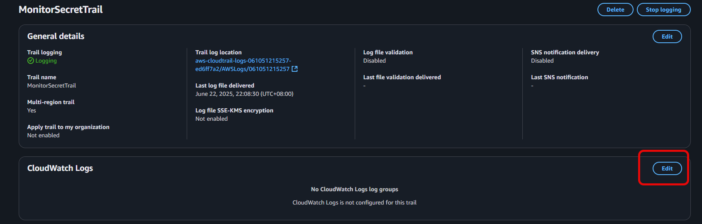

# 🔔 AWS Security Monitoring Project

Welcome to the **Security Monitoring System** project from NextWork! In this intermediate-level AWS project, you'll build an automated system to detect and alert when sensitive information (stored in AWS Secrets Manager) is accessed. This is a critical skill for roles in cloud security, DevOps, and system administration.

---

## 📋 Project Overview

**Title:** Build a Security Monitoring System
**Difficulty:** Pretty Spicy 🌶️
**Time:** \~90 Minutes
**Cost:** \$0 (AWS Free Tier)
**Tools Needed:** AWS Account, AWS CLI (for some steps)

You will:

* Store a secret securely in **AWS Secrets Manager**
* Track access events using **AWS CloudTrail**
* Create metrics and alarms with **Amazon CloudWatch**
* Set up notifications with **Amazon SNS**
* Compare CloudTrail SNS integration vs CloudWatch alerts

---

## 🚀 Step-by-Step Instructions

### Step 1: Create a Secret in Secrets Manager

1. Go to **AWS Secrets Manager**.
2. Create a new secret with the type “Other type of secret”.
3. Add a key-value pair: `SecretKey` : `MySensitiveData123` (or anything for testing).
4. Name it `TopSecretInfo`.
5. Leave all other settings default and create the secret.

🔐 **Secrets Manager** helps you store sensitive information like API keys or credentials. In this project, we simulate storing something sensitive to detect and react to access.


---

### Step 2: Enable CloudTrail

1. Go to **CloudTrail**.
2. Create a trail named `MonitorSecretTrail`.
3. Choose **Management Events** only (no data events needed).
4. Enable logging for **Read** and **Write** management events.
5. Create a new S3 bucket or select an existing one to store logs.

📌 **CloudTrail** captures AWS account activity and logs it to S3. Accessing secrets is a **management event** and is free to track.


---

### Step 3: Test Access and Validate CloudTrail

1. Retrieve the secret in two ways:

   * From the Secrets Manager console.
   * Using AWS CLI:

     ```bash
     aws secretsmanager get-secret-value --secret-id TopSecretInfo
     ```
2. Go to **CloudTrail > Event History**.
3. Filter by event name `GetSecretValue`.

✅ If the event appears in history, CloudTrail is logging access attempts properly.


---

### Step 4: Set Up CloudWatch Log Group and Metric Filter

1. In **CloudTrail**, confirm logs are delivered to S3.
2. **CloudTrail** In **CloudWatch Logs**, Click Enable, create a log group if needed.
3. In **CloudWatch** Navigate to **Log Insights**, then select your CloudTrail log group.
4. Click **Action** to Create a **Metric Filter**:

   * Filter pattern:

     ```
     { "GetSecretValue" }
     ```
   * Metric name: `SecretAccessCount`
   * Namespace: `SecretMonitoring`
   * Metric value: `1`

📊 This metric will increment every time your secret is accessed.




---

### Step 5: Create CloudWatch Alarm

1. Go to **CloudWatch Log groups> Metric filters > Check 'GetSecretValue' > Create alarm**.
2. Select the metric `SecretAccessCount` in namespace `SecretMonitoring`.
3. Set the threshold:

   * **Whenever metric is greater than or equal to 1** over 5 minutes.
4. Choose **Create new SNS topic**:

   * Name: `SecretAlertTopic`
   * Add your email to receive alerts. **Create topic**
5. Confirm email subscription (check inbox).
6. 

🔔 Now your system will send alerts when your secret is accessed!


---

### Step 6: Trigger the Alarm

1. Retrieve your secret again.
2. Wait 1–2 minutes.
3. Confirm:

   * Email alert is received.
   * Alarm status in CloudWatch changes to **In alarm**.

💡 Troubleshooting Tip:
If no alert arrives, check the alarm logic (e.g., SUM vs AVERAGE) and make sure log delivery to CloudWatch is active.


---

### Step 7 (Bonus): Enable CloudTrail to Send SNS Alerts Directly

1. Go to **CloudTrail > Trails**. > **Edit**
2. Enable **SNS Notification**.
3. Create a topic and subscribe your email.

📬 You will now receive alerts directly from CloudTrail whenever new logs are delivered to your S3 bucket.

🆚 **Compare CloudTrail SNS vs CloudWatch Alerts:**

* CloudTrail SNS sends **frequent raw log notifications** (less readable).
* CloudWatch Alarms provide **filtered, refined alerts** when exact criteria are met.


---


## 🧠 Key Concepts Learned

* Secrets Management best practices
* Difference between CloudTrail and CloudWatch Logs
* Creating alarms and metrics
* Triggering SNS alerts
* Understanding logging and security monitoring systems

---

## 🗑️ Cleanup Checklist

* Delete the secret in **Secrets Manager**
* Disable the CloudTrail trail (optional)
* Delete the CloudWatch alarm and metric filters
* Remove the SNS topic and unsubscribe email
* Delete the log group if no longer used
* Delete the s3 bucket

---

## 🏁 Wrap-Up & Share

You’ve now built a secure and responsive monitoring system that:

* Tracks when secrets are accessed
* Sends alerts via SNS
* Uses real AWS services like CloudTrail, CloudWatch, SNS, Secrets Manager

---

> 🎉 Congratulations on completing the AWS Security Monitoring project!

You’re now equipped with real-world monitoring skills to protect cloud assets.
