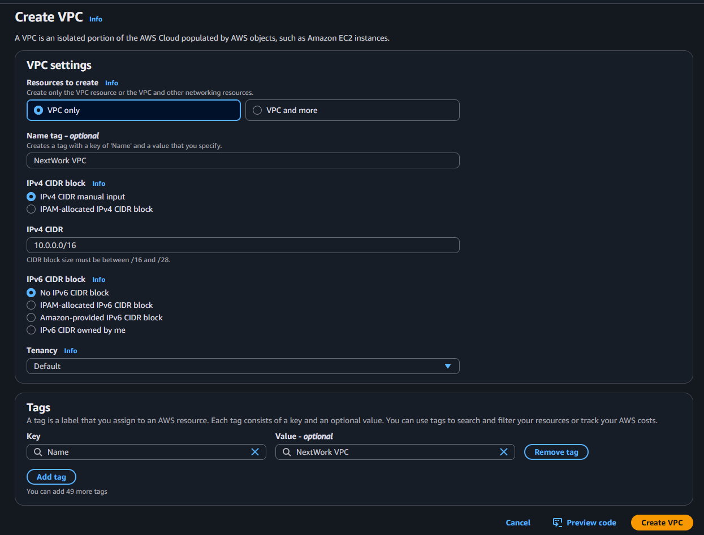
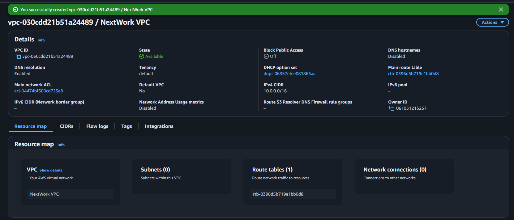
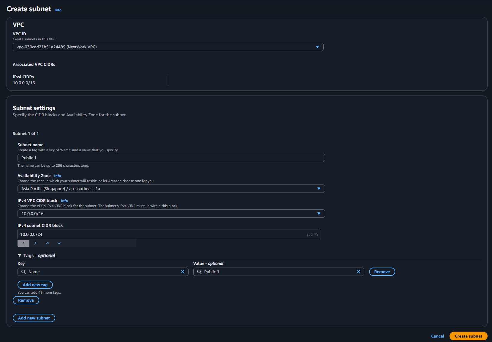
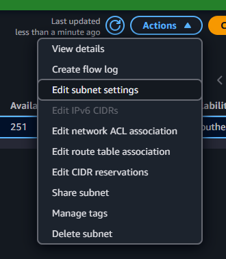
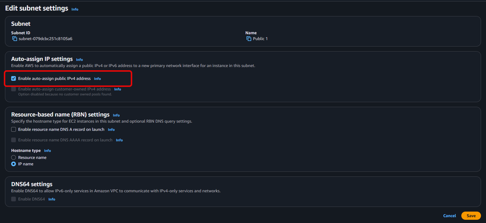
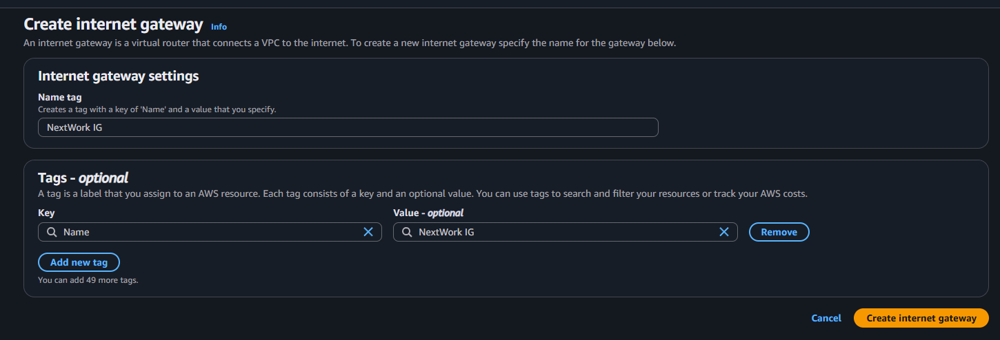
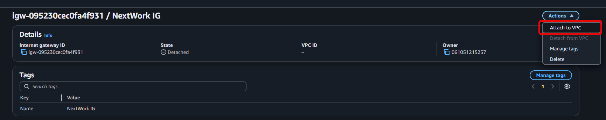
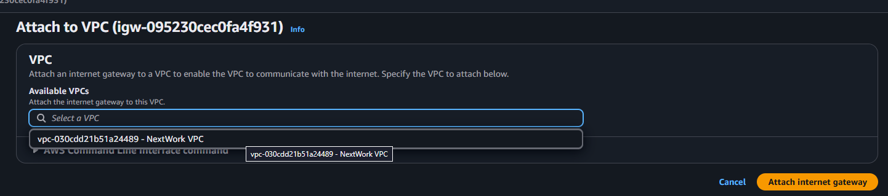

# 🛠️ AWS Networking Project 1: Build a Virtual Private Cloud (VPC) on AWS

Welcome! In this project, you’ll learn the **basics of AWS networking** by setting up your own Virtual Private Cloud (VPC), step-by-step.

🕒 **Time:** ~60 minutes  
💰 **Cost:** Free (on Free Tier)  
🌱 **Skill Level:** Beginner

---

## 📚 What You'll Learn

- What a VPC is and why it matters
- How to create a custom VPC
- How to set up public subnets
- How to configure an Internet Gateway
- Basic IP & CIDR concepts in AWS

---

## 🧰 Prerequisites

- An [AWS account](https://aws.amazon.com/)
- Basic knowledge of cloud computing concepts
- Optional: Install [AWS CLI](https://docs.aws.amazon.com/cli/latest/userguide/getting-started-install.html)

---

## 🪜 Step-by-Step Guide

### ☁️ Step 1: Create a VPC

1. **Login to AWS Console**  
   Go to [AWS Console](https://console.aws.amazon.com/).

2. **Search "VPC"**  
   In the search bar, type `VPC` and select **VPC Dashboard**.

3. **Navigate to "Your VPCs"**  
   Click `Your VPCs` in the left panel.

4. **Create VPC**
   - Click `Create VPC`
   - Choose `VPC Only`
   - **Name Tag:** `NextWork VPC`
   - **IPv4 CIDR Block:** `10.0.0.0/16`
   - Leave the rest as default and click **Create VPC**

🧠 *What’s a CIDR?*  
CIDR defines the IP address range for your VPC. `10.0.0.0/16` gives you 65,536 possible IPs!




---

### 🧱 Step 2: Create a Subnet

1. In the VPC dashboard, go to `Subnets`.

2. Click `Create Subnet`
   - **VPC ID:** Select `NextWork VPC`
   - **Subnet Name:** `Public 1`
   - **AZ:** Choose the first available
   - **IPv4 CIDR block:** `10.0.0.0/24` (smaller segment of your VPC)

3. Click `Create Subnet`

4. Select your new subnet > Actions > `Edit subnet settings`
   - Enable **Auto-assign public IPv4 address**
   - Save

📘 *Why public?*  
This will let resources (like EC2) in the subnet get a public IP for internet access.





---

### 🌐 Step 3: Create and Attach an Internet Gateway

1. In VPC dashboard, go to `Internet Gateways`.

2. Click `Create Internet Gateway`
   - **Name tag:** `NextWork IG`
   - Click **Create**

3. Select the new IG > Actions > `Attach to VPC`
   - Choose `NextWork VPC` > Click **Attach**

🧠 *What’s an IG?*  
An Internet Gateway connects your private VPC to the internet.





---

## 🧹 Clean Up: Delete Your Resources

To avoid charges:

1. Go to `VPC > Your VPCs`
2. Select `NextWork VPC` > Actions > Delete
   - This also deletes your subnet and IG

If needed:
- Delete IG in `Internet Gateways`
- Delete subnet in `Subnets`

---

## 💡 Concepts Recap

| Concept | Description |
|--------|-------------|
| **VPC** | A private, virtual network in AWS |
| **Subnet** | A smaller range of IPs within your VPC |
| **CIDR Block** | Defines how many IPs your network/subnet can have |
| **Internet Gateway** | Connects your VPC to the internet |
| **Public Subnet** | A subnet where resources can access the internet |

---

🔧 AWS CLI Script: Create VPC + Public Subnet + IGW

Here’s an **AWS CLI script** that recreates your “NextWork VPC” project setup described in the README. It includes creating a VPC, subnet, enabling public IPs, and attaching an Internet Gateway — all from the command line.

---

## 🔧 AWS CLI Script: Create VPC + Public Subnet + IGW

> 💡 Run this in your terminal **after configuring AWS CLI** with `aws configure`.

```bash
#!/bin/bash

# Set variables
VPC_NAME="NextWork VPC"
VPC_CIDR="10.0.0.0/16"

SUBNET_NAME="Public 1"
SUBNET_CIDR="10.0.0.0/24"
AVAILABILITY_ZONE="us-east-1a"  # Update if needed

IGW_NAME="NextWork IG"

# 1. Create VPC
echo "Creating VPC..."
VPC_ID=$(aws ec2 create-vpc --cidr-block $VPC_CIDR \
  --tag-specifications "ResourceType=vpc,Tags=[{Key=Name,Value=$VPC_NAME}]" \
  --query 'Vpc.VpcId' --output text)
echo "VPC ID: $VPC_ID"

# 2. Enable DNS hostname support (for public IPs to work properly)
aws ec2 modify-vpc-attribute --vpc-id $VPC_ID --enable-dns-support "{\"Value\":true}"
aws ec2 modify-vpc-attribute --vpc-id $VPC_ID --enable-dns-hostnames "{\"Value\":true}"

# 3. Create Subnet
echo "Creating Subnet..."
SUBNET_ID=$(aws ec2 create-subnet --vpc-id $VPC_ID \
  --cidr-block $SUBNET_CIDR --availability-zone $AVAILABILITY_ZONE \
  --tag-specifications "ResourceType=subnet,Tags=[{Key=Name,Value=$SUBNET_NAME}]" \
  --query 'Subnet.SubnetId' --output text)
echo "Subnet ID: $SUBNET_ID"

# 4. Enable Auto-assign Public IP on Subnet
aws ec2 modify-subnet-attribute --subnet-id $SUBNET_ID --map-public-ip-on-launch

# 5. Create Internet Gateway
echo "Creating Internet Gateway..."
IGW_ID=$(aws ec2 create-internet-gateway \
  --tag-specifications "ResourceType=internet-gateway,Tags=[{Key=Name,Value=$IGW_NAME}]" \
  --query 'InternetGateway.InternetGatewayId' --output text)
echo "IGW ID: $IGW_ID"

# 6. Attach Internet Gateway to VPC
aws ec2 attach-internet-gateway --internet-gateway-id $IGW_ID --vpc-id $VPC_ID
echo "Internet Gateway attached."

# 7. Create Route Table and route for Internet
ROUTE_TABLE_ID=$(aws ec2 create-route-table --vpc-id $VPC_ID \
  --query 'RouteTable.RouteTableId' --output text)
echo "Route Table ID: $ROUTE_TABLE_ID"

aws ec2 create-route --route-table-id $ROUTE_TABLE_ID \
  --destination-cidr-block 0.0.0.0/0 --gateway-id $IGW_ID

# 8. Associate Route Table with Subnet
aws ec2 associate-route-table --subnet-id $SUBNET_ID --route-table-id $ROUTE_TABLE_ID

echo "✅ VPC setup complete!"
```

---

## 🧼 Optional Cleanup Script

To delete all resources:

```bash
#!/bin/bash

# Replace with your actual resource IDs if known
VPC_ID="vpc-xxxxxxxx"
IGW_ID="igw-xxxxxxxx"
SUBNET_ID="subnet-xxxxxxxx"

# Detach and delete Internet Gateway
aws ec2 detach-internet-gateway --internet-gateway-id $IGW_ID --vpc-id $VPC_ID
aws ec2 delete-internet-gateway --internet-gateway-id $IGW_ID

# Delete Subnet
aws ec2 delete-subnet --subnet-id $SUBNET_ID

# Delete VPC
aws ec2 delete-vpc --vpc-id $VPC_ID

echo "🧹 Clean up complete!"
```

---


## 📦 Next Steps

Build on this by exploring:
- VPC Security Groups & NACLs
- Private Subnets & NAT Gateways
- Deploying EC2 Instances inside your VPC

---

