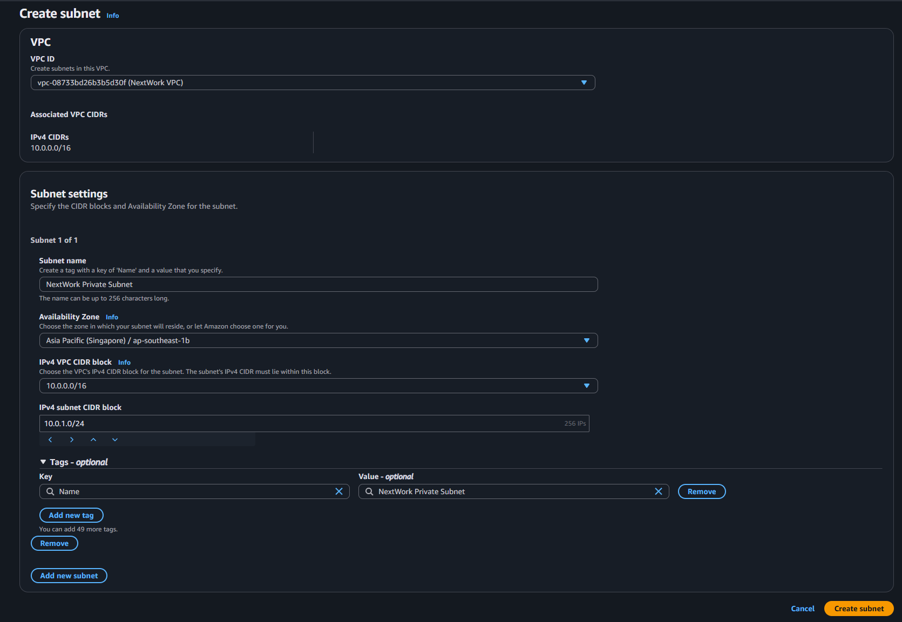
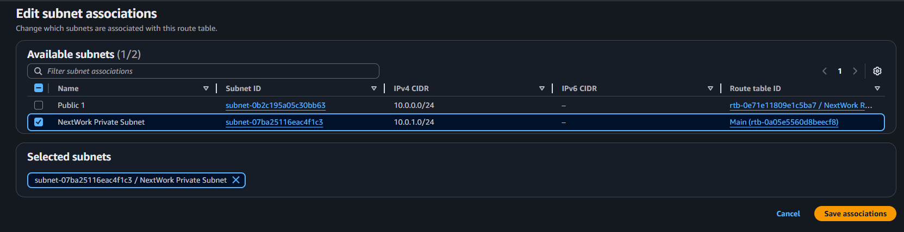
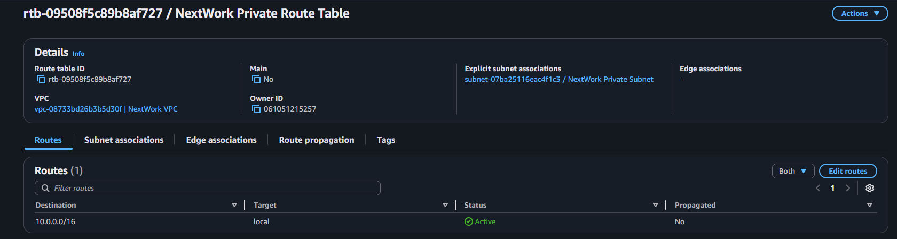
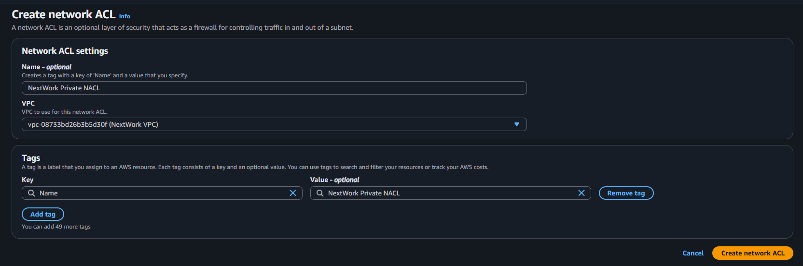
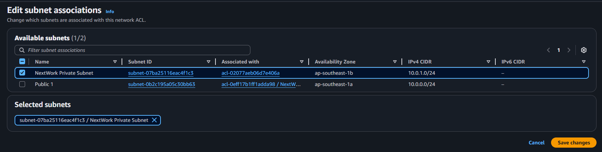
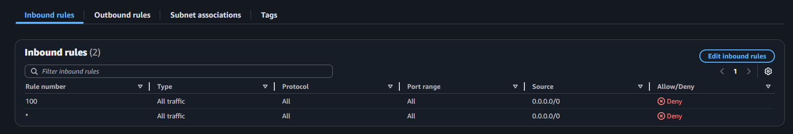
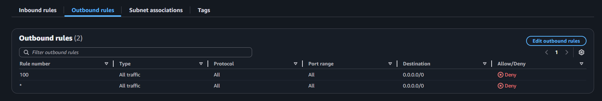

# 🔒 AWS Networking Project 3: Creating a Private Subnet

Welcome to your third AWS networking project!  
In this hands-on guide, you’ll learn how to add a **private subnet** to your VPC for storing secure internal resources like databases — isolated from public internet access.

> ✅ Make sure you’ve completed:
> - [✅ Project 1: Build a Virtual Private Cloud](https://github.com/Jerome-Pooh/AWS_Jerome_nextwork/tree/main/Build%20a%20Virtual%20Private%20Cloud%20(VPC)%20on%20AWS)  
> - [✅ Project 2: VPC Traffic Flow and Security](https://github.com/Jerome-Pooh/AWS_Jerome_nextwork/tree/main/VPC%20Traffic%20Flow%20and%20Security)

---

## 📘 Project Overview

| Feature       | Details                    |
|---------------|----------------------------|
| 🧠 Difficulty | Easy-ish                   |
| ⏱️ Time       | ~60 minutes                |
| 💰 Cost       | Free (AWS Free Tier)       |

---

## 🛠️ What You’ll Build

- A **private subnet** (in a different IP range)
- A **private route table** (no route to the internet)
- A **custom network ACL** (restricts traffic)

> 📦 You’ll reuse your existing VPC setup from previous projects.

---

## 🧰 Prerequisites

- An AWS Account
- Familiarity with VPC, Subnets, CIDR blocks, Route Tables, Security Groups, and ACLs
- Previously created:
  - `NextWork VPC`
  - `NextWork Public Subnet`
  - `NextWork IG`, `NextWork Route Table`, `NextWork SG`, and `NextWork Network ACL`

---

## 🪜 Step-by-Step Guide

---

### 🚷 Step 1: Create a Private Subnet

1. Go to **VPC > Subnets > Create Subnet**
2. Fill in:
   - **VPC ID:** `NextWork VPC`
   - **Subnet Name:** `NextWork Private Subnet`
   - **Availability Zone:** Choose the second one
   - **CIDR Block:** `10.0.1.0/24`

3. Click **Create subnet**

> 💡 CIDR Explanation:  
> `10.0.1.0/24` gives you 256 IPs and **does not overlap** with your public subnet (`10.0.0.0/24`).

✅ You now have a subnet with no internet access — yet.

---

### 🚧 Step 2: Create a Private Route Table

1. Go to **VPC > Route Tables > Create Route Table**
2. Fill in:
   - **Name tag:** `NextWork Private Route Table`
   - **VPC:** `NextWork VPC`

3. Click **Create Route Table**

4. Go to **Subnet Associations**
   - Click **Edit**
   - Select `NextWork Private Subnet`
   - Save

5. Go to **Routes Tab**
   - Confirm it only has `10.0.0.0/16 → local`
   - ⚠️ **No route to the Internet Gateway!**

✅ You’ve just ensured this subnet has **no path to the public internet**.

---

### 📋 Step 3: Create a Private Network ACL

1. Go to **VPC > Network ACLs > Create Network ACL**
2. Fill in:
   - **Name tag:** `NextWork Private NACL`
   - **VPC:** `NextWork VPC`
3. Click **Create**

4. Select your NACL > **Subnet Associations**
   - Click **Edit**
   - Select `NextWork Private Subnet`
   - Save

5. Add **Inbound Rule**:
   - Rule #: `100`
   - Type: `All Traffic`
   - Source: `0.0.0.0/0`
   - Action: `DENY`

6. Add **Outbound Rule**:
   - Rule #: `100`
   - Type: `All Traffic`
   - Destination: `0.0.0.0/0`
   - Action: `DENY`

> 🛡️ Why deny all?  
> Custom NACLs deny all traffic by default — this keeps your subnet **locked down** until explicitly opened.

---

## 🔄 Suggested Naming Conventions

| Resource Type     | Name                       |
|-------------------|----------------------------|
| Public Subnet     | `NextWork Public Subnet`   |
| Private Subnet    | `NextWork Private Subnet`  |
| Route Tables      | `NextWork Public/Private`  |
| Network ACLs      | `NextWork Public/Private`  |

---

## 📊 Public vs Private Subnet Comparison

| Feature             | Public Subnet             | Private Subnet              |
|---------------------|---------------------------|------------------------------|
| Internet Access     | ✅ Yes (via IGW)          | ❌ No                        |
| Route Table         | Has IGW route             | No IGW route                |
| Used For            | Web servers, APIs         | DBs, app backends           |
| NACL Default        | Allow all                 | Deny all                    |

---

## 🧼 Cleanup Instructions

Delete resources if you're not moving on to the next project today:

1. Go to **VPC > Your VPCs**
2. Select `NextWork VPC` → **Actions → Delete VPC**
3. Double check:
   - Subnets
   - Route Tables
   - IGWs
   - ACLs
   - Security Groups

> 🧠 This avoids leftover resources that might cost you later.

---

## 🧠 Concept Recap

| Concept       | Description |
|---------------|-------------|
| **CIDR Block** | Defines IP address ranges |
| **Private Subnet** | No internet access allowed |
| **Route Table** | Determines where traffic goes |
| **NACL** | Controls traffic at subnet level |
| **Security Group** | Controls traffic at instance level |

---

## 🙌 Credits

Based on the [NextWork Project Guide](https://learn.nextwork.org/projects/aws-networks-private?track=high)  
Expanded and explained for GitHub by a fellow cloud learner ☁️

---
