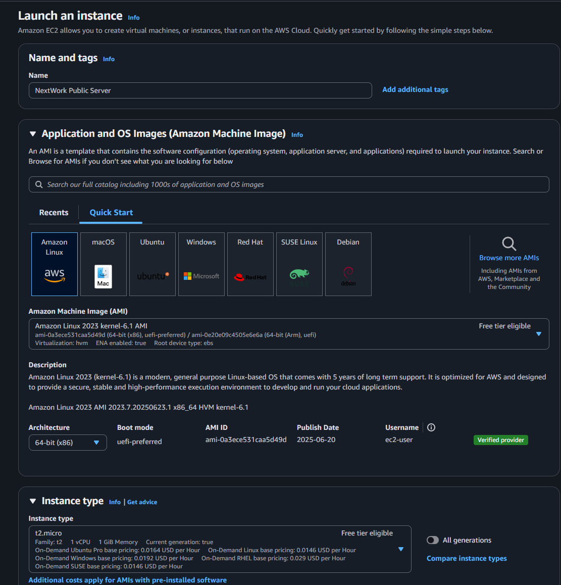
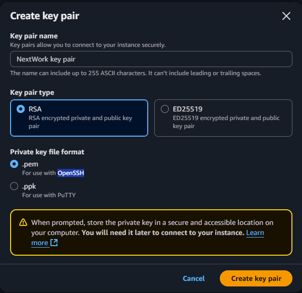
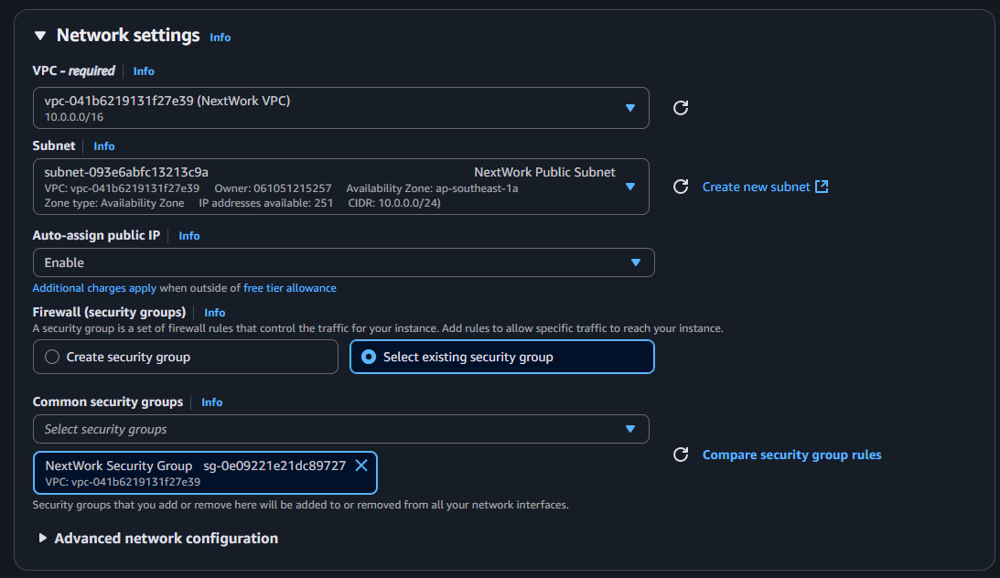
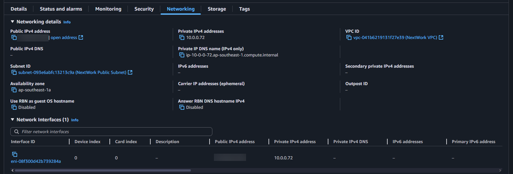
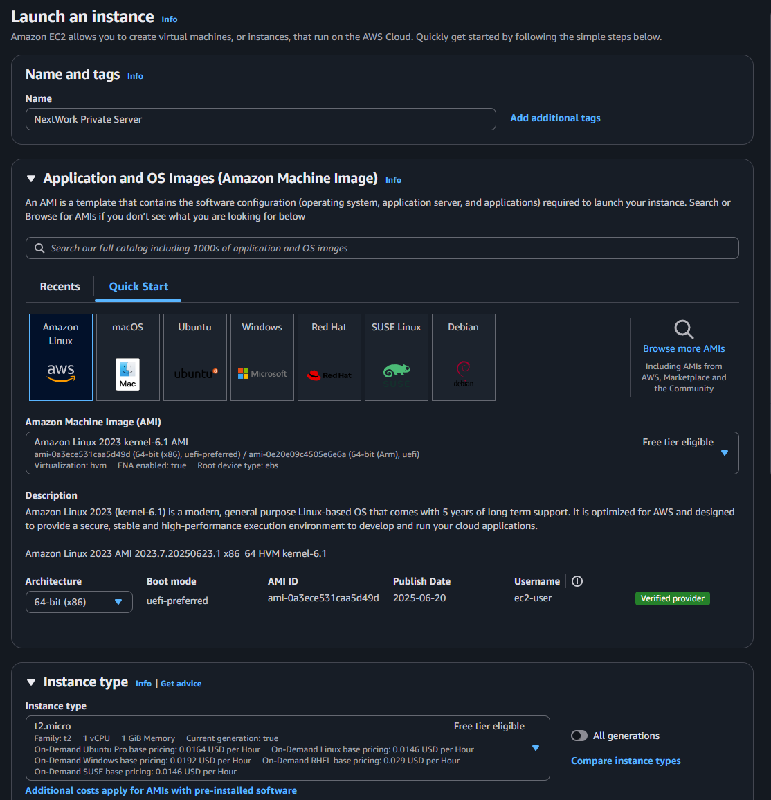
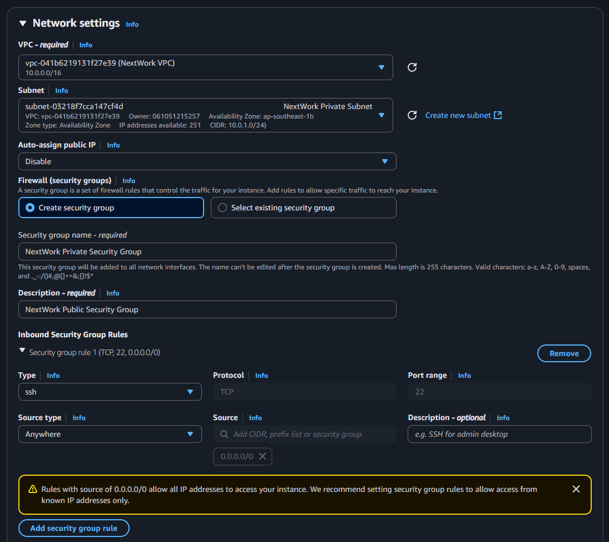
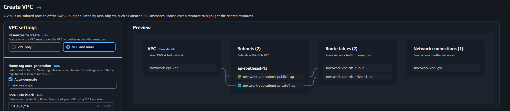
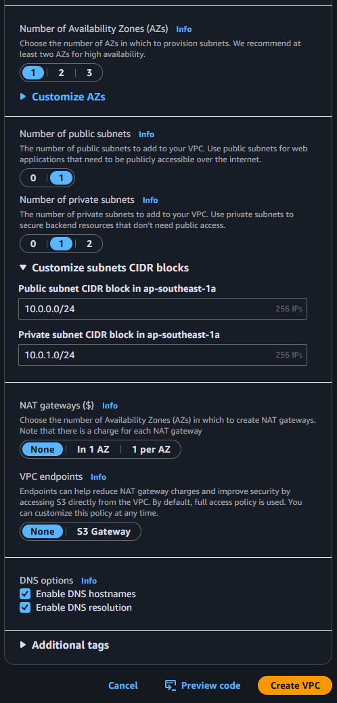

# 🚀 AWS Networking Project 4: Launching VPC Resources

Welcome to **Project 4** of the AWS Networking Series by [NextWork](https://learn.nextwork.org/projects/aws-networks-ec2?track=high). In this hands-on lab, you'll **launch EC2 instances into both public and private subnets** — and learn to visualize, secure, and test your VPC setup.

---

## 📦 What You’ll Build

- An EC2 instance in the **public subnet**
- An EC2 instance in the **private subnet**
- Security groups to **control access**
- Optional: Use the **VPC Wizard** to speed up infrastructure setup

---

## 🧰 Prerequisites

Before starting, make sure you’ve completed:

1. ✅ [Project 1: Build a VPC](https://github.com/Jerome-Pooh/AWS_Jerome_nextwork/tree/main/Build%20a%20Virtual%20Private%20Cloud%20(VPC)%20on%20AWS)
2. ✅ [Project 2: VPC Traffic Flow and Security](https://github.com/Jerome-Pooh/AWS_Jerome_nextwork/tree/main/VPC%20Traffic%20Flow%20and%20Security)
3. ✅ [Project 3: Creating a Private Subnet](https://github.com/Jerome-Pooh/AWS_Jerome_nextwork/tree/main/Creating%20a%20Private%20Subnet)

---

## 🧠 Key Concepts

| Concept            | Description                                                                 |
|--------------------|-----------------------------------------------------------------------------|
| **Amazon EC2**     | Virtual machines in the cloud                                               |
| **Security Groups**| Resource-level firewalls for EC2                                            |
| **Key Pairs**      | SSH credentials to access EC2 securely                                      |
| **VPC Wizard**     | A guided interface to launch full VPC setups in one go                      |

---

## 🪜 Step-by-Step Guide

---

### 💻 Step 1: Launch an EC2 Instance in Public Subnet

1. Go to the **EC2 Console**
2. Click **Launch Instances**
3. Name: `NextWork Public Server`
4. **AMI**: Amazon Linux 2023 AMI (Free Tier eligible)
5. **Instance type**: `t2.micro`

6. **Key pair**: Create a new one  
   - Name: `NextWork key pair`  
   - Format: `.pem`

7. **Network settings**:
   - VPC: `NextWork VPC`
   - Subnet: `NextWork Public Subnet`
   - Auto-assign public IP: ✅ enabled
   - Security group: Select existing → `NextWork Public Security Group`

8. Launch the instance
9. Go to the **Networking tab** to verify:
   - Public IPv4 address exists
   - Subnet and VPC are correctly associated

---

### 🤐 Step 2: Launch an EC2 Instance in Private Subnet

1. Back in the EC2 dashboard, click **Launch Instances**
2. Name: `NextWork Private Server`
3. **AMI**: Amazon Linux 2023 AMI
4. **Instance type**: `t2.micro`

5. **Key pair**: Reuse `NextWork key pair`
6. **Network settings**:
   - VPC: `NextWork VPC`
   - Subnet: `NextWork Private Subnet`
   - Auto-assign public IP: ❌ disabled
   - Security group: Create new →  
     - Name: `NextWork Private Security Group`  
     - Inbound: SSH from source → `NextWork Public Security Group`
7. Launch instance

🛡️ **Explanation**:  
Using the **public security group as the source** restricts access to only EC2 instances in the public subnet. This is a best practice for securing private subnets.

---

### 🗺️ Step 3: Launch a VPC Using the AWS VPC Wizard (Bonus)

Want to set up VPCs faster next time?

1. Go to the **VPC Console**
2. Click **Create VPC** → Choose `VPC and more`
3. Review the **Resource Map** to see:
   - Internet Gateway
   - 2 Public + 2 Private Subnets
   - Route Tables

4. Name tag: `nextwork-vpc`
5. Set CIDR Block: `10.0.0.0/16`
6. Select 1 AZs
7. Customize subnet CIDRs:
   - Public: `10.0.0.0/24`
   - Private: `10.0.1.0/24`
8. Set **NAT Gateway** to `None` (to stay in Free Tier)
9. Set **VPC Endpoint** to `None`
10. Click **Create VPC**

🧠 The resource map helps you **visualize** how components like subnets, gateways, and route tables are linked.

---

## 🧽 Step 4: Cleanup Resources

To avoid AWS charges:

1. **Terminate EC2 instances**:
   - Go to EC2 → Instances → Select all → Actions → Terminate

2. **Delete VPCs**:
   - Go to VPC → Your VPCs → Select `NextWork VPC` and `nextwork-vpc` → Delete
   - If blocked, delete associated **ENIs (Elastic Network Interfaces)** first

3. **Verify deletion** in:
   - Subnets
   - Route Tables
   - IGWs
   - ACLs
   - Security Groups

---

## 📸 Bonus: Suggested Screenshots

Capture and upload for documentation:

- Public EC2 instance networking details
- Private EC2 security group config
- VPC wizard resource map
- VPC setup confirmation

---

## 🧠 Recap: What You Learned

- ✅ Launch EC2 in a **public subnet**
- ✅ Launch EC2 in a **private subnet**
- ✅ Create and use **key pairs**
- ✅ Secure private EC2 instances using **inbound group references**
- ✅ Use the **VPC wizard** for faster deployments

---

## 🙌 Credits

Based on the [NextWork guide](https://learn.nextwork.org/projects/aws-networks-ec2?track=high)  
Summarized and documented for portfolio use.

---

## 🧠 Next Steps

Head to [Project 5: Testing VPC Connectivity](https://learn.nextwork.org/projects/aws-networks-connectivity?track=high) to verify and test what you built!

