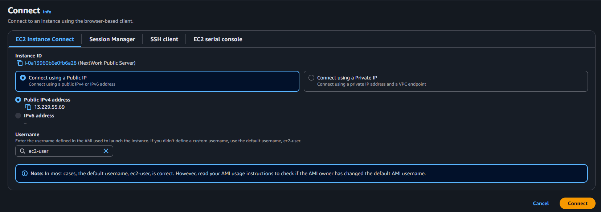
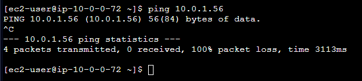
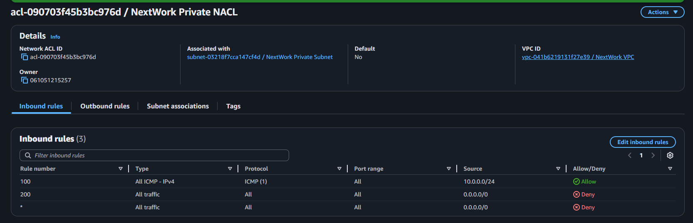
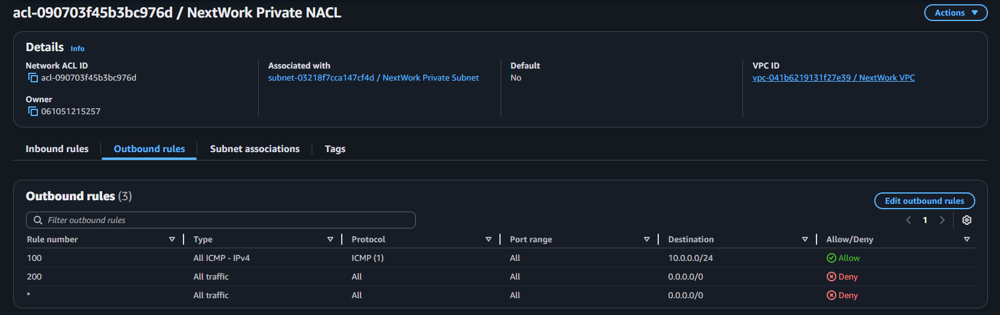
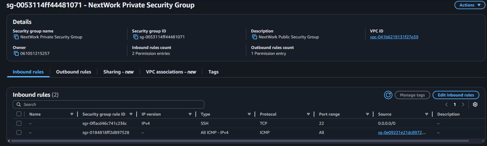
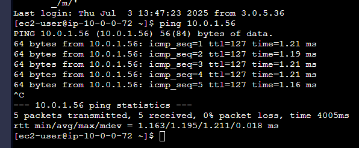

# 🌐 AWS Networking Project 5: Testing VPC Connectivity

Welcome to **Project 5** of the AWS Networking Series by [NextWork](https://learn.nextwork.org/projects/aws-networks-connectivity?track=high)!

You've already set up a complete network infrastructure in Projects 1–4. In this project, you'll **test and validate connectivity** between your EC2 instances and the internet.

---

## 📦 What You’ll Do

- ✅ Connect to your Public EC2 instance via EC2 Instance Connect
- ✅ Test private-to-public EC2 communication with `ping`
- ✅ Test internet access from public subnet using `curl`
- ✅ Troubleshoot and fix security group and NACL configurations

---

## 🧰 Prerequisites

You must have completed:

- ✅ [Project 1: Build a VPC](https://github.com/Jerome-Pooh/AWS_Jerome_nextwork/tree/main/Build%20a%20Virtual%20Private%20Cloud%20(VPC)%20on%20AWS)
- ✅ [Project 2: VPC Traffic Flow and Security](https://github.com/Jerome-Pooh/AWS_Jerome_nextwork/tree/main/VPC%20Traffic%20Flow%20and%20Security)
- ✅ [Project 3: Creating a Private Subnet](https://github.com/Jerome-Pooh/AWS_Jerome_nextwork/tree/main/Creating%20a%20Private%20Subnet)
- ✅ [Project 4: Launching VPC Resources](https://github.com/Jerome-Pooh/AWS_Jerome_nextwork/tree/main/Launching%20VPC%20Resources)

---

## 🧠 Key Concepts

| Concept          | Description                                                                 |
|------------------|-----------------------------------------------------------------------------|
| **EC2 Instance Connect** | Connect to EC2 from the Console without a key pair                |
| **ICMP Protocol** | Used by `ping` to test internal communication                             |
| **curl**         | Tests HTTP communication to external websites                              |
| **Security Groups** | Instance-level firewall (stateful)                                    |
| **Network ACLs** | Subnet-level firewall (stateless)                                          |

---

## 🪜 Steps

---

### ⬆️ Step 1: Connect to the Public Server

1. Go to **EC2 → Instances**
2. Select `NextWork Public Server`
3. Click **Connect → EC2 Instance Connect**
4. Leave default settings → Click **Connect**

> ⚠️ If connection fails, ensure your Public Security Group allows **SSH (port 22)** from `0.0.0.0/0`.



---

### 🤝 Step 2: Test Internal Connectivity with `ping`

1. From the EC2 console, get the **Private IP** of `NextWork Private Server`
2. In the EC2 Instance Connect terminal (from the Public Server), run:

```bash
ping <Private IP>
````

Example:

```bash
ping 10.0.1.147
```

> ❌ If you don’t get replies, ICMP traffic is likely being blocked.



---

### 🔧 Step 3: Allow ICMP in NACLs and Security Groups

#### ✅ In **Private NACL**:

* **Inbound Rule**

  * Rule #: 100
  * Type: All ICMP – IPv4
  * Source: `10.0.0.0/24`



* **Outbound Rule**

  * Rule #: 100
  * Type: All ICMP – IPv4
  * Destination: `10.0.0.0/24`



#### ✅ In **Private Security Group**:

* Add Inbound Rule:

  * Type: All ICMP – IPv4
  * Source: `NextWork Public Security Group`



Retry the `ping` test — you should now see multiple reply lines confirming communication between the instances.



---

### 🌍 Step 4: Test Internet Connectivity with `curl`

In the Public Server's EC2 terminal:

```bash
curl example.com
curl nextwork.org
curl https://learn.nextwork.org/projects/aws-host-a-website-on-s3
```

You should see raw HTML as output, confirming that your public subnet has access to the internet.

> ✅ This proves your **Internet Gateway**, **Route Table**, and **Security Group** settings are working correctly.

---

## 🧼 Cleanup Instructions

If you're done with this project and not proceeding to the next one:

### ✅ Terminate EC2 Instances

* Go to **EC2 Console → Instances**
* Select both instances
* Actions → Instance state → Terminate

### ✅ Delete VPC

* Go to **VPC Console → Your VPCs**
* Select `NextWork VPC` → Actions → Delete
* If blocked, delete ENIs manually first

Also check and clean up:

* Subnets
* Internet Gateways
* Route Tables
* NACLs
* Security Groups

---

## ✅ What You Learned

| Task                                | Done |
| ----------------------------------- | ---- |
| Connect to EC2 via Instance Connect | ✅    |
| Internal EC2 ping test              | ✅    |
| Allow ICMP in NACLs + SGs           | ✅    |
| Test internet with `curl`           | ✅    |

---

## 🙌 Credits

Built using the [NextWork Project Guide](https://learn.nextwork.org/projects/aws-networks-connectivity?track=high)
Documented by a fellow AWS learner ☁️

---

## 🧭 Next Step

➡️ [Project 6: VPC Peering](https://learn.nextwork.org/projects/aws-networks-peering?track=high)

```
