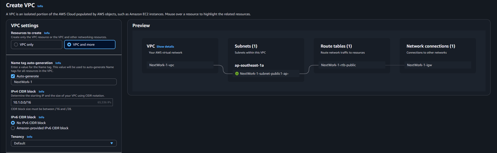

# 🚀 AWS Networking Project 6 : VPC Peering 

This project is part of the [NextWork AWS Networking Series](https://learn.nextwork.org/projects/aws-networks-peering?track=high), and builds on five previous projects. You’ll create and test a **VPC peering connection** between two separate VPCs in the same region using the AWS Console.

> ⚠️ You must complete the first five projects in the series before starting this:
>
> * ✅ [Project 1: Build a VPC](https://github.com/Jerome-Pooh/AWS_Jerome_nextwork/tree/main/Build%20a%20Virtual%20Private%20Cloud%20%28VPC%29%20on%20AWS)
> * ✅ [Project 2: VPC Traffic Flow and Security](https://github.com/Jerome-Pooh/AWS_Jerome_nextwork/tree/main/VPC%20Traffic%20Flow%20and%20Security)
> * ✅ [Project 3: Creating a Private Subnet](https://github.com/Jerome-Pooh/AWS_Jerome_nextwork/tree/main/Creating%20a%20Private%20Subnet)
> * ✅ [Project 4: Launching VPC Resources](https://github.com/Jerome-Pooh/AWS_Jerome_nextwork/tree/main/Launching%20VPC%20Resources)
> * ✅ [Project 5: Testing VPC Connectivity](https://github.com/Jerome-Pooh/AWS_Jerome_nextwork/tree/main/Testing%20VPC%20Connectivity)

---

## 🚀 Project Overview

This project is focused on creating a **VPC Peering connection** between two VPCs and ensuring connectivity between them using private IP addresses. You'll also launch EC2 instances in each VPC to verify that the peering works as expected.

---

## 🛠️ Prerequisites

* ✅ An AWS Account – [Sign up here](https://portal.aws.amazon.com/billing/signup)
* ✅ Familiarity with AWS VPC concepts from the previous projects

---

## 📍 Step-by-Step Guide

### 📦 Step 1: Create Two VPCs

You need two separate VPCs with unique CIDR blocks to set up peering between them.

**Instructions:**

1. Open the **VPC Console**.
2. Click **Create VPC** > Choose **VPC and more**.
3. For **VPC 1**:

   * Name: `NextWork-1`
   * CIDR: `10.1.0.0/16`
   * 1 public subnet
   * No private subnets
   * No NAT Gateway

4. For **VPC 2**:

   * Name: `NextWork-2`
   * CIDR: `10.2.0.0/16`
   * Same settings as VPC 1

   
   

**Explanation:** Using separate CIDR blocks ensures there is no IP conflict between VPCs, which is a requirement for VPC peering.

---

### 🌉 Step 2: Create VPC Peering Connection

Establish a private network link between the two VPCs.

**Instructions:**

1. Go to **Peering Connections** in the VPC console.
2. Click **Create Peering Connection**.
3. Set the requester as `NextWork-1`, and accepter as `NextWork-2`.
4. Click **Create**, then go to **Actions > Accept request** to finalize.

**Explanation:** A peering connection allows instances in different VPCs to communicate as if they were in the same network, using private IP addresses.

---

### ⚖️ Step 3: Update Route Tables

Now, you need to define routes to direct traffic between the VPCs.

**Instructions:**

* Go to **Route Tables**, edit VPC 1's route table:

  * Destination: `10.2.0.0/16`
  * Target: Peering Connection
  * Select: VPC 1 <> VPC 2
* Edit VPC 2's route table:

  * Destination: `10.1.0.0/16`
  * Target: Peering Connection
  * Select: VPC 1 <> VPC 2

**Explanation:** Without route table entries, even a successful peering connection won't route traffic. You must define the path manually.

---

### 💻 Step 4: Launch EC2 Instances in Each VPC

Create one EC2 instance in each VPC to test peering.

**Instructions:**

* Name: Instance - NextWork VPC 1 and Instance - NextWork VPC 2
* AMI: Amazon Linux 2023
* Instance type: `t2.micro`
* Network: Choose the VPC and public subnet respectively
* Disable public IP
* Use default security group

**Explanation:** These instances will help test private communication over the peering connection.

---

### 🌐 Step 5: Allocate & Assign Elastic IP (to Instance 1)

**Instructions:**

1. Go to **Elastic IPs** and allocate a new IP in the VPC console..
2. Associate it with Instance in VPC 1.

**Explanation:** Since we disabled public IP during launch, we need a static Elastic IP to SSH into the instance using EC2 Instance Connect.

---

### 🔒 Step 6: Modify Security Group Inbound Rules

**Instructions:**

* Go to **Security Groups** for VPC 1
* Edit inbound rules:

  * Type: SSH
  * Source: Anywhere (0.0.0.0/0)

**Explanation:** This allows you to connect to your instance via SSH from your local machine or browser-based EC2 Instance Connect.

---

### 🤕 Step 7: Test VPC Peering with Ping

**Instructions:**

1. SSH into EC2 in VPC 1 using EC2 Instance Connect.
2. Get private IP of EC2 in VPC 2.
3. Run: `ping <private-ip-vpc2>`

If ping fails:

* Go to **VPC 2 Security Group** and add:

  * Type: All ICMP - IPv4
  * Source: `10.1.0.0/16`

**Explanation:** Security groups block ICMP (ping) traffic by default. Allowing ICMP verifies that the peering and route table updates work.

---

### Step 8: Cleanup

To avoid AWS charges:

* Terminate EC2 instances
* Release Elastic IP
* Delete peering connection
* Delete both VPCs

---

## 📖 Summary

You've learned how to:

* 🌉 Peer two VPCs privately
* 🛋️ Configure route tables for cross-VPC traffic
* 🚀 Launch EC2s and test connectivity securely

---

## 🔗 Next Step

* Start the next project: [VPC Monitoring with Flow Logs](https://learn.nextwork.org/projects/aws-networks-logs)

---