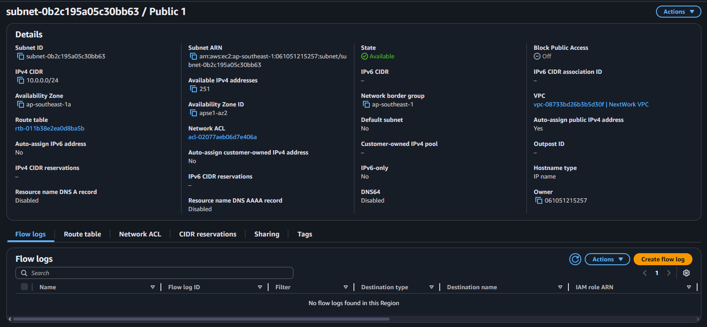
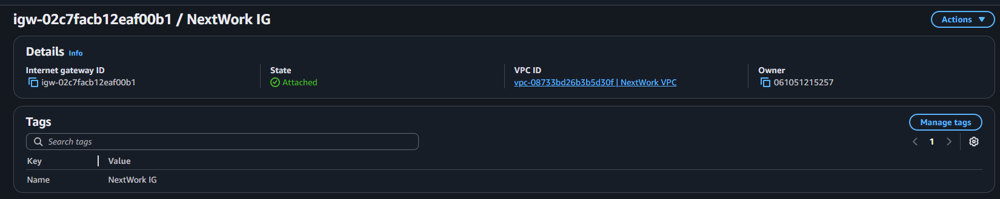
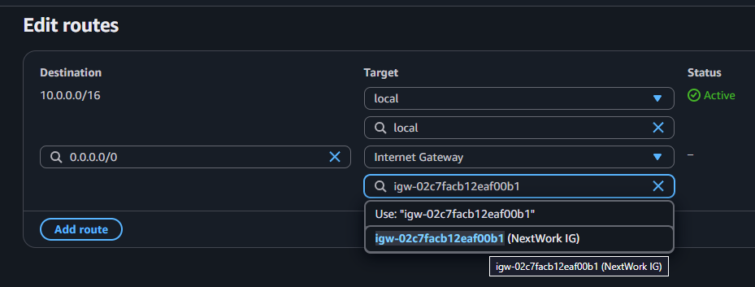
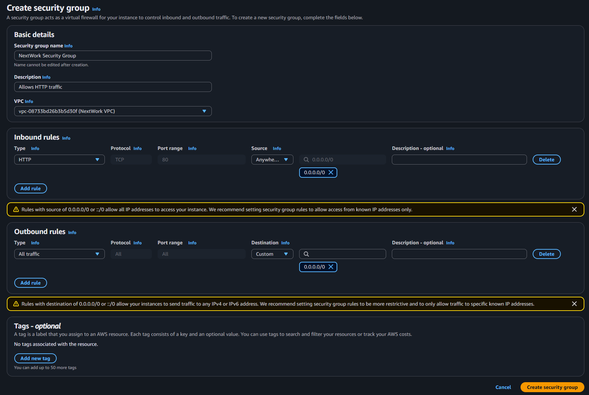
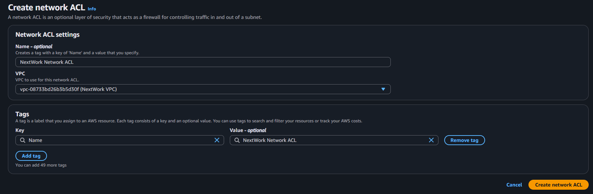
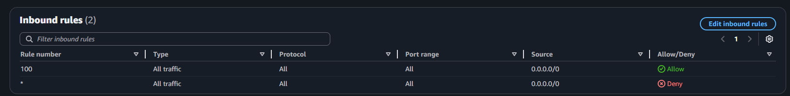
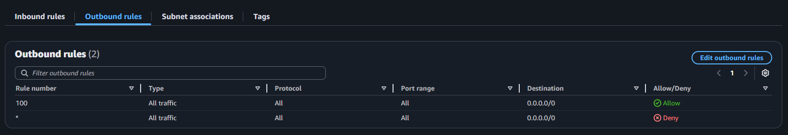
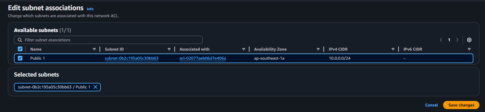

# 🔐 AWS Networking Project 2: VPC Traffic Flow and Security

Welcome to the second part of the AWS networking series! In this project, you'll learn how to **control traffic flow and enforce security rules** in your custom Virtual Private Cloud (VPC). You’ll implement the foundational layers of network security in AWS.

> ✅ This project builds on [Project 1: Build a Virtual Private Cloud](https://github.com/Jerome-Pooh/AWS_Jerome_nextwork/tree/main/Build%20a%20Virtual%20Private%20Cloud%20(VPC)%20on%20AWS). Complete that first if you haven't already.

---

## 📘 Project Overview

| Feature       | Details              |
| ------------- | -------------------- |
| 🧠 Difficulty | Easy                 |
| 🕒 Time       | \~60 minutes         |
| 💰 Cost       | Free (AWS Free Tier) |

---

## 🛠️ What You'll Build

You’ll enhance your VPC by adding:

* A **Route Table** to control how network traffic is directed
* A **Security Group** to protect your individual AWS resources
* A **Network ACL** to control traffic at the subnet level

Together, these define how your applications interact with the internet and other AWS resources.

---

## 🧰 Prerequisites

* An active [AWS account](https://aws.amazon.com/)
* Completion of [Project 1: Build a Virtual Private Cloud](https://github.com/Jerome-Pooh/AWS_Jerome_nextwork/tree/main/Build%20a%20Virtual%20Private%20Cloud%20(VPC)%20on%20AWS)
* Basic understanding of networking terms: CIDR, subnet, gateway, etc.

---

## 🪜 Step-by-Step Guide

### ☁️ Step 1: Set Up Your VPC Infrastructure

This section repeats the essential steps from Project 1 to set up your VPC foundation.

1. **Create a VPC**:

   * Go to **VPC Dashboard > Your VPCs > Create VPC**
   * Name: `NextWork VPC`
   * CIDR block: `10.0.0.0/16` (Allows 65,536 IPs)


2. **Create a Public Subnet**:

   * Go to **Subnets > Create subnet**
   * VPC: `NextWork VPC`
   * Name: `Public 1`
   * Availability Zone: Select the first in your region
   * Subnet CIDR block: `10.0.0.0/24` (256 IPs)
   * Enable **auto-assign public IPv4** to ensure internet accessibility



3. **Create and Attach an Internet Gateway (IGW)**:

   * Go to **Internet Gateways > Create**
   * Name: `NextWork IG`
   * Attach to `NextWork VPC`



> 🧠 A VPC is your own virtual network. Subnets are sections of this network. An IGW provides a doorway to the internet.

---

### 🚏 Step 2: Configure a Route Table

A route table controls how traffic moves within your VPC and how it gets in and out.

1. **Create a Route Table**:

   * Go to **Route Tables > Create route table**
   * Name: `NextWork Route Table`
   * VPC: `NextWork VPC`

2. **Add a Route to the Internet**:

   * Edit the new route table → Routes tab → Edit routes
   * Add route: `Destination: 0.0.0.0/0`, `Target: Internet Gateway (NextWork IG)`

3. **Associate Route Table with Subnet**:

   * Go to the **Subnet Associations tab**
   * Select `Public 1` subnet

> 📘 Think of a route table like a GPS that tells packets where to go — local or internet.



---

### 👮‍♀️ Step 3: Create a Security Group (SG)

Security groups act like firewalls for individual AWS resources (like EC2 instances).

1. **Create the Security Group**:

   * Go to **Security Groups > Create**
   * Name: `NextWork Security Group`
   * Description: `Allows HTTP traffic`
   * VPC: `NextWork VPC`

2. **Add Inbound Rule**:

   * Type: `HTTP`
   * Port: `80`
   * Source: `0.0.0.0/0` (allows public access)

> 🔐 Security Groups only allow explicitly defined traffic. By default, all inbound traffic is denied.



---

### 📋 Step 4: Set Up a Network ACL (NACL)

Network ACLs provide subnet-level traffic filtering. Unlike security groups, they support **allow** and **deny** rules.

1. **Create Network ACL**:

   * Go to **Network ACLs > Create**
   * Name: `NextWork Network ACL`
   * VPC: `NextWork VPC`



2. **Add Inbound Rule**:

   * Rule #: `100`
   * Type: `All Traffic`
   * Source: `0.0.0.0/0`
   * Allow



3. **Add Outbound Rule**:

   * Rule #: `100`
   * Type: `All Traffic`
   * Destination: `0.0.0.0/0`
   * Allow



4. **Associate Subnet**:

   * Subnet: `Public 1`



> 🛡️ Network ACLs are like police at subnet entry/exit. They work alongside security groups to add another layer of protection.

---

## 🧼 Cleanup

To avoid unwanted charges:

1. Go to **Your VPCs > Select `NextWork VPC` > Actions > Delete VPC**
2. Verify that associated resources (subnet, IGW, route table, security group, ACL) are deleted

---

## 🧠 Concepts Recap

| Component      | Role & Responsibility                           |
| -------------- | ----------------------------------------------- |
| VPC            | Isolated network in AWS                         |
| Subnet         | Subdivision of the VPC IP space                 |
| Route Table    | Manages direction of traffic within/outside VPC |
| Security Group | Resource-level firewall (instance-based)        |
| Network ACL    | Subnet-level firewall (stateless)               |

---

### 📦 AWS CLI Script: Set Up VPC Traffic Flow and Security

Use this script to create all the necessary components for the project: VPC, public subnet, internet gateway, route table, security group, and network ACL.

```bash
#!/bin/bash

######################################
# AWS Networking Project 2: VPC Traffic Flow and Security
# This script creates:
# - VPC
# - Public Subnet
# - Internet Gateway
# - Route Table with Internet Access
# - Security Group (allows HTTP)
# - Network ACL (allows all in/out)
######################################

# -------------------------------
# CONFIGURATION VARIABLES
# -------------------------------

REGION="ap-southeast-1"
AZ="${REGION}a"
VPC_NAME="NextWork VPC"
SUBNET_NAME="NextWork Public Subnet"
IGW_NAME="NextWork IG"
RT_NAME="NextWork Public Route Table"
SG_NAME="NextWork Security Group"
SG_DESC="Allows HTTP traffic"
ACL_NAME="NextWork Public Network ACL"
VPC_CIDR="10.0.0.0/16"
SUBNET_CIDR="10.0.0.0/24"

# -------------------------------
# CREATE VPC
# -------------------------------

echo "  Creating VPC..."
VPC_ID=$(aws ec2 create-vpc \
  --cidr-block $VPC_CIDR \
  --region $REGION \
  --tag-specifications "ResourceType=vpc,Tags=[{Key=Name,Value=$VPC_NAME}]" \
  --query 'Vpc.VpcId' --output text)
echo " VPC created: $VPC_ID"

# -------------------------------
# CREATE SUBNET
# -------------------------------

echo "  Creating Subnet..."
SUBNET_ID=$(aws ec2 create-subnet \
  --vpc-id $VPC_ID \
  --cidr-block $SUBNET_CIDR \
  --availability-zone $AZ \
  --tag-specifications "ResourceType=subnet,Tags=[{Key=Name,Value=$SUBNET_NAME}]" \
  --query 'Subnet.SubnetId' --output text)

aws ec2 modify-subnet-attribute \
  --subnet-id $SUBNET_ID \
  --map-public-ip-on-launch

echo " Subnet created: $SUBNET_ID"

# -------------------------------
# CREATE INTERNET GATEWAY
# -------------------------------

echo "  Creating Internet Gateway..."
IGW_ID=$(aws ec2 create-internet-gateway \
  --tag-specifications "ResourceType=internet-gateway,Tags=[{Key=Name,Value=$IGW_NAME}]" \
  --query 'InternetGateway.InternetGatewayId' --output text)

aws ec2 attach-internet-gateway \
  --internet-gateway-id $IGW_ID \
  --vpc-id $VPC_ID

echo " Internet Gateway created and attached: $IGW_ID"

# -------------------------------
# CREATE ROUTE TABLE
# -------------------------------

echo "  Creating Route Table..."
RT_ID=$(aws ec2 create-route-table \
  --vpc-id $VPC_ID \
  --tag-specifications "ResourceType=route-table,Tags=[{Key=Name,Value=$RT_NAME}]" \
  --query 'RouteTable.RouteTableId' --output text)

aws ec2 create-route \
  --route-table-id $RT_ID \
  --destination-cidr-block 0.0.0.0/0 \
  --gateway-id $IGW_ID

aws ec2 associate-route-table \
  --route-table-id $RT_ID \
  --subnet-id $SUBNET_ID

echo " Route Table created and associated: $RT_ID"

# -------------------------------
# CREATE SECURITY GROUP
# -------------------------------

echo "  Creating Security Group..."
SG_ID=$(aws ec2 create-security-group \
  --group-name "$SG_NAME" \
  --description "$SG_DESC" \
  --vpc-id $VPC_ID \
  --query 'GroupId' --output text)

aws ec2 authorize-security-group-ingress \
  --group-id $SG_ID \
  --protocol tcp \
  --port 80 \
  --cidr 0.0.0.0/0

echo " Security Group created: $SG_ID"

# -------------------------------
# CREATE NETWORK ACL
# -------------------------------

echo "  Creating Network ACL..."
ACL_ID=$(aws ec2 create-network-acl \
  --vpc-id "$VPC_ID" \
  --tag-specifications "ResourceType=network-acl,Tags=[{Key=Name,Value=$ACL_NAME}]" \
  --query 'NetworkAcl.NetworkAclId' --output text)
echo " Network ACL created: $ACL_ID"


# --- START Network ACL Association (Reverted to replace-network-acl-association with improved logging) ---
echo "  Attempting to associate Network ACL '$ACL_ID' with subnet '$SUBNET_ID'..."

# Get current ACL association ID
# Get current NACL association for the subnet
ASSOC_ID=$(aws ec2 describe-network-acls \
  --filters Name=association.subnet-id,Values=$SUBNET_ID \
  --query "NetworkAcls[0].Associations[0].NetworkAclAssociationId" \
  --output text)

# Replace existing NACL association with the new one
aws ec2 replace-network-acl-association \
  --association-id $ASSOC_ID \
  --network-acl-id $ACL_ID

echo " Replaced NACL association on Subnet"


# Add Ingress rule (allows all inbound traffic)
echo "  Adding Ingress rule to Network ACL ($ACL_ID)..."
aws ec2 create-network-acl-entry \
  --network-acl-id "$ACL_ID" \
  --rule-number 100 \
  --protocol -1 \
  --rule-action allow \
  --ingress \
  --cidr-block 0.0.0.0/0
echo " Ingress rule added to ACL."

# Add Egress rule (allows all outbound traffic)
echo "  Adding Egress rule to Network ACL ($ACL_ID)..."
aws ec2 create-network-acl-entry \
  --network-acl-id "$ACL_ID" \
  --rule-number 101 \
  --protocol -1 \
  --rule-action allow \
  --egress \
  --cidr-block 0.0.0.0/0
echo " Egress rule added to ACL."

echo " Replaced NACL association on Subnet"

# --- END Network ACL Association (Updated Logic) ---

# -------------------------------
# DONE
# -------------------------------

echo ""
echo "🎉 Your VPC with Route Table, Security Group, and ACL is ready!"
echo "🔹 VPC ID:        $VPC_ID"
echo "🔹 Subnet ID:     $SUBNET_ID"
echo "🔹 IGW ID:        $IGW_ID"
echo "🔹 Route Table:   $RT_ID"
echo "🔹 Sec Group ID:  $SG_ID"
echo "🔹 ACL ID:        $ACL_ID"
```

---

### 🧼 AWS CLI Script: Cleanup Resources

Use this script to clean up your AWS environment after completing the project. Replace the placeholder values with the actual IDs printed by the setup script.

```bash
#!/bin/bash

##########################################
# Cleanup Script for AWS Networking Project 2:
# VPC Traffic Flow and Security
#
# This script safely deletes all the AWS
# resources created during the project:
# - Internet Gateway
# - Route Table
# - Subnet
# - Security Group
# - Network ACL
# - VPC
#
# Make sure to update the variables below with
# the correct values printed from your setup script.
##########################################

# ----------------------------
# 📝 Replace with your resource IDs
# ----------------------------
VPC_ID="vpc-0b0510072654fac05"
SUBNET_ID="subnet-0dc0baf93f9150ea0"
IGW_ID="igw-05b62f5a7f8ef4ed4"
RT_ID="rtb-02aba91fd09e79b06"
SG_ID="sg-0ca25228ca39d91ff"
ACL_ID="acl-0c7b482dfa5f6097e"

echo "⚠️  Starting cleanup..."

# ----------------------------
# 1. Detach and delete IGW
# ----------------------------
echo "🔌 Detaching Internet Gateway from VPC..."
aws ec2 detach-internet-gateway --internet-gateway-id $IGW_ID --vpc-id $VPC_ID

echo "❌ Deleting Internet Gateway..."
aws ec2 delete-internet-gateway --internet-gateway-id $IGW_ID

# ----------------------------
# 2. Disassociate and delete Route Table
# ----------------------------
echo "🔗 Disassociating Route Table..."
ASSOC_ID=$(aws ec2 describe-route-tables \
  --route-table-ids $RT_ID \
  --query "RouteTables[0].Associations[?Main==\`false\`].RouteTableAssociationId" \
  --output text)

if [ -n "$ASSOC_ID" ]; then
  aws ec2 disassociate-route-table --association-id $ASSOC_ID
  echo "✅ Disassociated: $ASSOC_ID"
fi

echo "🧭 Deleting Route Table..."
aws ec2 delete-route-table --route-table-id $RT_ID

# ----------------------------
# 3. Disassociate and delete Network ACL
# ----------------------------
echo "🔗 Disassociating Network ACL from Subnet..."
ACL_ASSOC_ID=$(aws ec2 describe-subnets \
  --subnet-ids $SUBNET_ID \
  --query "Subnets[0].NetworkAclAssociationId" \
  --output text)

aws ec2 replace-network-acl-association \
  --association-id $ACL_ASSOC_ID \
  --network-acl-id $(aws ec2 describe-network-acls \
    --filters Name=default,Values=true Name=vpc-id,Values=$VPC_ID \
    --query "NetworkAcls[0].NetworkAclId" --output text)

echo "✅ ACL replaced with default"

echo "📋 Deleting Network ACL..."
aws ec2 delete-network-acl --network-acl-id $ACL_ID

# ----------------------------
# 4. Delete Subnet
# ----------------------------
echo "🧱 Deleting Subnet..."
aws ec2 delete-subnet --subnet-id $SUBNET_ID

# ----------------------------
# 5. Delete Security Group
# ----------------------------
echo "🛡️ Deleting Security Group..."
aws ec2 delete-security-group --group-id $SG_ID

# ----------------------------
# 6. Delete VPC
# ----------------------------
echo "🏙️ Deleting VPC..."
aws ec2 delete-vpc --vpc-id $VPC_ID

echo "✅ Cleanup complete! All resources deleted."

```

---